# Assignment 3: Experiment

Imogen Cleaver-Stigum, Andrew Nolan, Matthew St. Louis, and Jyalu Wu

[Published Site](https://cs573-a3.web.app)  

## Experiment
### Intro and background: Cleveland-McGill paper
In 1984, William Cleveland and Robert McGill conducted a famous experiment in graphical perception that was momentous for the field of data visualization. This experiment provided a controlled setting to test the efficacy of pie charts, bar charts, and stacked bar variants. The results of the study revealed that bar charts were easier to read and compare than pie charts. Participants had nearly double the log error when comparing the ratio of small to large values in pie charts. The study further determined that position was the most effective visual channel for magnitude.

Now, we seek to recreate the results of this experiment by running our own study to compare the effectiveness of the position and angle visual channels by comparing bar charts, pie charts, and spiral histograms. Additionally, we developed several demographic questions to seek further insight into the differences in perception of data visualizations. In the following sections we discuss our hypotheses, experimental procedure, and study results. 

If you wish to view our experiment you can access it here: https://cs573-a3.web.app/.

### Hypotheses
We decided to test 3 types of hypotheses: three regarding how the type of visualization affects the accuracy of people’s perceptions and four regarding whether demographic information has any affect on this. 

#### Hypotheses about Types of Vis
- Users will have more accurate perceptions of relative bar/sector sizes in bar charts compared to pie charts. 
- Users will have more accurate perceptions of relative bar sizes in bar charts compared to spiral histograms. 
- Users will have more accurate perceptions of relative bar/sector sizes in pie charts compared to spiral histograms. 

#### Hypotheses about Demographics 
- Users who are more familiar with vis will have more accurate perceptions of relative bar/sector sizes overall.
- Users with a higher education level will have more accurate perceptions of relative bar/sector sizes overall. 
- Users who are in the fields of data science and math will have more accurate perceptions of relative bar/sector sizes overall. We hypothesize this because these individuals might be more accustomed to looking at different kinds of visualizations.
- Users who have more statistics experience will have more accurate perceptions of relative bar/sector sizes overall.  

## Design & Setup
### Runthrough or tour of our survey/website
The interface we designed walks the user through our experiment in steps. The landing view is a welcome screen explaining a bit about the experiment and the class it is for.

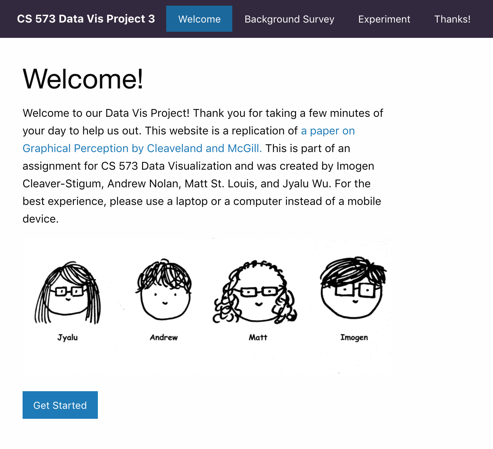

When the user presses the “Get Started” button to advance, they will see a screen for the survey. The user will answer questions about their level of education, formal statistics training, familiarity with data visualization, and field of study. Once all questions have a valid response, the user can activate the “Submit” button to continue to the experiment (Described in the “[Our Charts](#our-charts)” section). 

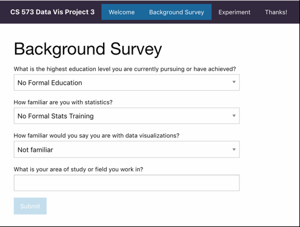

When the user has completed the experiment, they will be presented with the following Thank You view, inviting them to submit more data if they wish to. This allows them to answer more questions about the visualizations without re-entering the survey information. 

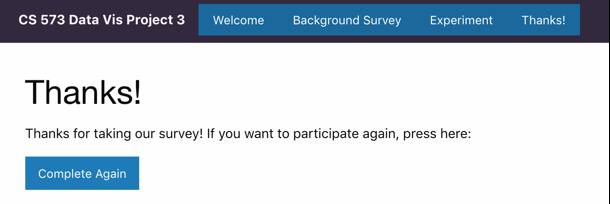
### Our Charts
During the experiment, the user is presented with fifteen visualizations. Five of these are bar charts, five of these are pie charts, and five of these are spiral histograms. Their ordering is random. Each has two sections marked, and the user’s task is to answer what portion of the larger marked section is represented by the smaller marked section. The marked areas are randomly generated, though they are always guaranteed to be separated by at least one unmarked area.

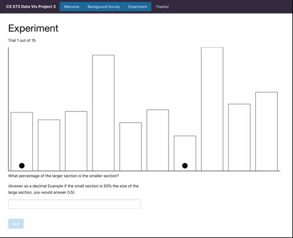

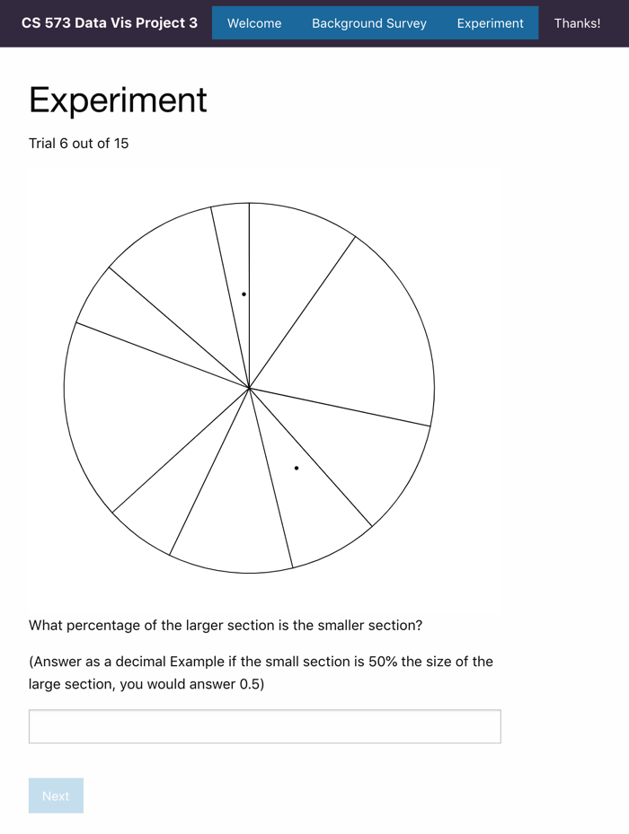

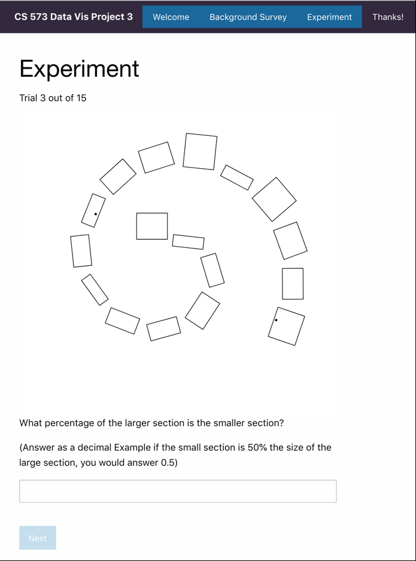

## Results

We received 45 responses to our survey, each participant received 15 questions (5 for each visualization type), for a total of 675 data points (225 per vis type). Here we will discuss the results from our experiment and survey. The result dataset can be seen in the Github repository in the file “cs573-a3-final-export.json” in the data folder. There is also a .csv version of the data and a python script to convert the json to csv. The hypotheses presented above correspond to the following plots made in ggplot2 in R. All of the confidence intervals are at a 95% confidence level. 

Our results may also be slightly skewed due to the design of the experiment and the wording of the instructions. We received feedback from multiple (5 or more) participants that they were confused by the instructions at first. Some of them answered the first couple questions with a misunderstanding of the instructions, and then figured out what we were asking as they answered more questions. Other participants had to ask for help or additional explanation to answer any questions. This might affect our results because some of the data we collected is skewed based on misunderstandings of the instructions. It might also affect our demographic data because it is possible that people who are more familiar with this type of experiment of this field were more likely to understand the instructions. This would mean that the differences in log error types by demographic groups might be representative of their ability to understand the instructions rather than their ability to accurately perceive the proportions. 

### Vis Types
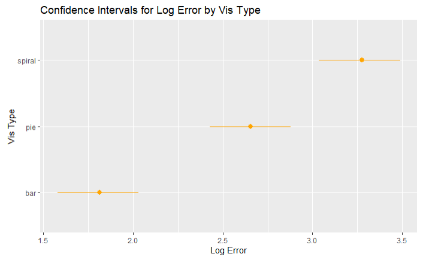

The confidence intervals for the log error of estimates provide evidence that our three hypotheses about the vis types were all correct. The bar charts had lower average log error than pie charts, and pie charts had lower average log error than spiral bar charts. The confidence intervals have no overlap, so we can be 95% confident that the three hypotheses are true as we have tested them in this experiment. 

From this data, we can reasonably conclude that bar charts are more effective at accurately representing data values than pie charts. These two chart types can be used to represent the same data, so they are relatively comparable. However, the spiral barchart also had some other factors that make it less simple to compare directly to the bar charts and pie charts. For example, the spiral barcharts had 17 data points each, whereas the pie charts and bar charts had 10 data points each. This was the case because the spiral bar charts are made to have more data points than 10, so they do not look like spirals with too few points. This could have caused more distraction and confusion for participants. Also, because there are more bars, but we used the same rules to generate the data, the proportional differences between the sizes of the spiral bar chart bars is slightly different from those of the bar charts and pie charts. This could also have affected perceptions, because it can be easier or harder to accurately perceive the difference between two things based on how significant the difference is. 

Another difference is that the bars on the bar chart were physically larger on the page than the bars on the spiral bar chart or the sectors on the pie chart. This means that other than just the difference of vis type, the bar charts may seem to have more accurate perceptions because the participants found it easier to perceive differences when the bars/sectors were larger. 

Overall, we conclude that the bar charts appear better than pie charts, and pie charts better than spiral bar charts, for accuracy of perceptions, based on the conditions of this experiment. However, we acknowledge that there were other factors than just the vis type that may also have affected these confidence intervals. 

### Demographic Information
The following figures show the results of our experiment broken down by each of the tested demographics. For each axis of comparison, the points shown aggregate all responses for that group across all three visualization types (bar chart, pie chart, spiral histogram). We discuss how comparison reflects on its respective hypothesis.

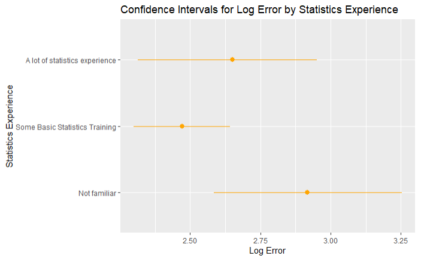

This figure compares log error between different levels of statistics experience. Our initial hypothesis for statistics experience was that log error would decrease as statistics experience increases. The figure shows that this trend is weak at best. Those with the least statistics experience did worst as a group, but the mean for basic statistics training was better than that for a lot of statistics experience. The basic statistics training group had the smallest error bars, but this was likely due to the fact that the category consisted of roughly three times as many trails as the others. Overall, the data do not support our hypothesis.

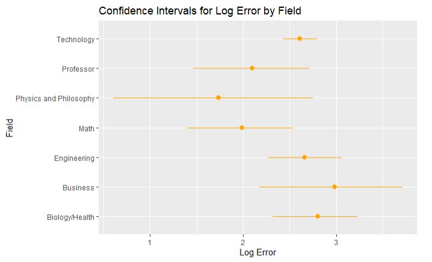

Our initial hypothesis for fields presumed mathematicians and data scientists would perform the best in this experiment. Unfortunately, no one taking the survey self-identified as a data scientist. However, we did receive responses from mathematicians. The math field did perform in the upper echelon, only being beaten by the physics and philosophy combination. However, it should be noted only one person identified as physics and philosophy, so the confidence interval is very large. Although our results do not completely match our hypothesis, with more data points it is plausible that math would be the highest and they did perform better than most categories. So the hypothesis is mostly correct.

The combination of Physics and Philosophy, on average, performing the best does have an interesting correlation with data from other sources. According to [GRE results from 2012](https://www.wcu.edu/WebFiles/PDFs/PhilosophyPerformanceGRE.pdf), Physics and Philosophy are the two highest performing majors on the exam. With physics receiving the highest average score for quantitative reasoning, and philosophy receiving the highest scores in analytical and verbal reasoning. This may imply that the reasoning skills tested on the GRE are associated with visualization comprehension.

There are some limitations on our field hypothesis results. The sample was not representative of all disciplines. The largest field reported in our testing demographic was technology; unsurprisingly a disproportionately large number of our sample was computer science majors. As we primarily solicited responses from WPI students, humanities fields are unrepresented in our data. Future work would benefit from seeking a larger sample size from a more diverse population.

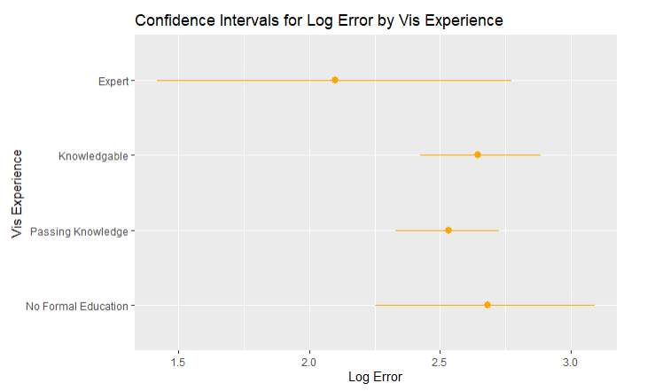

Our initial hypothesis was that users who are more familiar with reading visualizations would have more accurate perceptions of relative section sizes and thus the log error would be lower. Based on our results, people who self-reported as experts with visualizations did better than others on average. This is in line with our hypothesis, however only one participant self-identified as an expert so this may have skewed the data. In addition, those passing knowledge did somewhat better than those who were knowledgeable about visualizations, and those with no formal education did only slightly worse than the knowledgeable group on average. These results contradict our hypothesis, and thus the outcomes of our experiment do not strongly support our hypothesis.

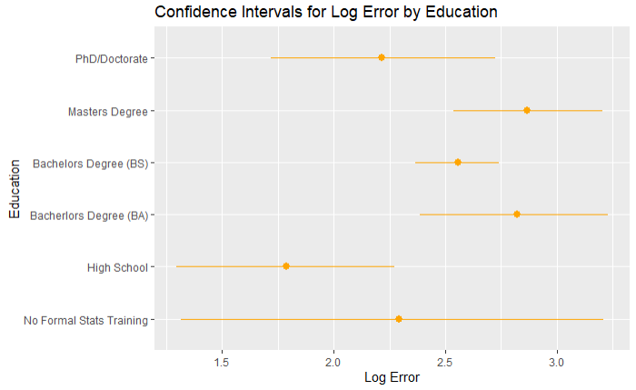

The confidence intervals in the graph above show the average log error for our survey participants based on self-reported education level. Our initial hypothesis stated that users with higher education levels would perform better in this experiment. Based on our results, this hypothesis is not true. Participants with (or currently pursuing) a PhD or other doctorate degree did perform better, on average, than other college degrees. However, participants who self-reported their highest education level as high school performed better on average than all other education levels. Additionally, the worst performing education level, according to our experiment, was Masters students. These results defy our initial hypothesis. Based on the results we can assume that there is no correlation between education level and performance when analyzing graphs. There are limitations to our results. The vast majority of participants identified as Bachelors (BS) students, followed by masters students. If future work were to be done on this hypothesis, it would benefit the study to have more participants at the extremes with PhDs or with only high school education. We only received two participants in both of these categories.

## Technical Achievements
- __React frontend__: We used React to design a responsive, data-driven frontend. This ended up being really helpful for displaying arbitrarily many trials to the user and updating various parts of the UI with each action the user performs. Our group agreed to use React for this project because some group members had little experience with it and wanted to learn more web technologies. We created a data flow to preserve the form data across multiple submissions of the experiment and to collect data from each trial. React’s philosophy of updating state by replacing objects rather than mutating them inspired our design for persisting individual data points generated in each trial in our database.
- __Firebase Realtime Database__: Firebase Realtime Database is a free to use NoSQL cloud database. We downloaded the keys and used the Firebase API in our React code to upload the results of the survey to the database. NoSQL and JSON complement each other very nicely so we were able to store our survey results as an object in the React state and then insert that directly into the real time database. When we were ready to analyze our data, we exported the database as a JSON file.
- __Firebase Hosting__: We used Google’s Firebase Hosting platform to host our React application. Firebase Once we built the React app with the npm run build command we were able to use the Firebase command line tool to upload the optimized production version of the React app. Firebase then publishes the app to a custom URL based on our project name. For this assignment, it provided us with the custom URL: https://cs573-a3.web.app/.
- __Demographics__: We designed a form to collect demographic data on participants’ visualization expertise, and we designed our database structure to store these records with each data submission. This involved learning how to use forms in Angular and managing data between components. We used this data to search for correlations between experience and accuracy within our results.

## Design Achievements
- __Spirals__: The spiral barcharts are a design achievement because they are a more complicated type of chart and getting them to look like spirals required some work. They are made by drawing a “path” on the svg that is a spiral, placing bars at even intervals along the path with one corner touching the path, and rotating the bars to align better with the curve. The spiral barcharts had to have more data points than the other chart types in order to look like spirals. For example, a spiral barchart with only 10 data points looked more like a jumble of randomly placed/oriented bars than a spiral. With 14 bars, the spiral barcharts looked like spirals, and with 17, they looked more presentable. 17 bars was also the maximum we could make without the random data generation taking too long, so this is the number of bars we chose to include. 
- __We doodled our faces!__ Another design achievement is the set of drawings of us on the Welcome page of the experiment app. They make the Welcome page much more visually appealing! They also make the app more personal, which is useful when all of the people participating in the experiment are people we know.
- __Styled with Foundation__: We styled the frontend using [Foundation](https://get.foundation/sites). Nobody in the group had previous experience with this styling library, but we wanted to try something new. We successfully used it to give our site a modern look with a consistent feel.
- __Demographic questions__: The demographic questions are an extra element of experiment design that adds to the kind of results we can analyze. They enabled us to look not only at how the vis-es themselves influence perceptions, but also how different experience and exposure might affect people’s perceptions. They are also a design achievement because we added a tab on the app for the “survey” where participants are asked the demographic questions (familiarity with vis, occupation/field, education level, and statistics experience). 

## Sources
### React
1. Primary Tutorial: https://reactjs.org/tutorial/tutorial.html 
2. `componentDidAct()` React hook for D3: https://blog.logrocket.com/data-visualization-in-react-using-react-d3-c35835af16d0/ 
3. React Forms: https://reactjs.org/docs/forms.html 
### Firebase
4. Firebase Realtime Database + React: https://www.youtube.com/watch?v=0pC8dEqSKkc&ab_channel=AVDojo
5. How to Deploy a React App with Firebase Hosting: https://medium.com/swlh/how-to-deploy-a-react-app-with-firebase-hosting-98063c5bf425
6. Creating a Production Build in React: https://create-react-app.dev/docs/production-build/
### Data Visualizations
7. Condegram (Spiral histogram): https://observablehq.com/@sawyerclick/condegram 
8. Condegram Spiral Plot: https://bl.ocks.org/arpitnarechania/027e163073864ef2ac4ceb5c2c0bf616
9. Basic barplot in d3.js: https://www.d3-graph-gallery.com/graph/barplot_basic.html 
10. Pie Chart: https://www.d3-graph-gallery.com/pie.html 
11. How to shuffle an array using Javascript: https://www.geeksforgeeks.org/how-to-shuffle-an-array-using-javascript/
### Foundation
12. Foundations Sites: https://get.foundation/sites 
13. Foundations blog template we used as a reference: https://get.foundation/templates-previews-sites-f6-xy-grid/blog-simple.html 
### Other
14. Philosophy and Physics Performance on the GRE: https://www.wcu.edu/WebFiles/PDFs/PhilosophyPerformanceGRE.pdf

